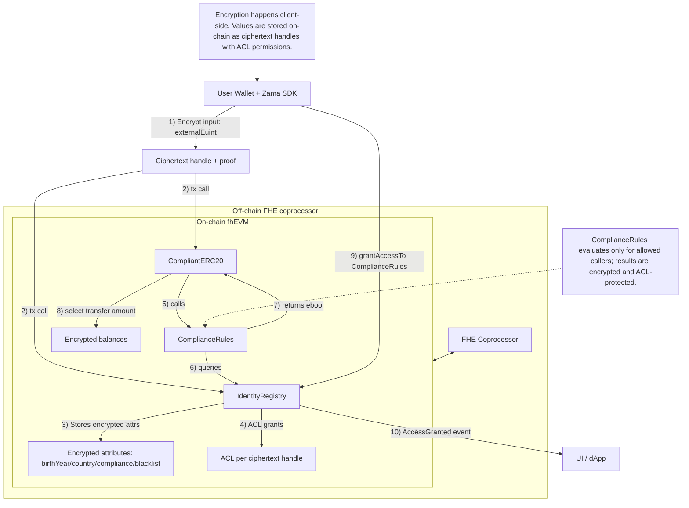

# Zentity FHEVM Architecture (Web3 Data Flow)

This document focuses on the Web3 data flow and where encryption happens in the
fhEVM flow. It is meant to be a high-level map for developers and reviewers.

## Web3 Data Flow (Encrypted State + Compliance)

### Key points
- **Encryption happens client-side** using the Zama SDK. Inputs are submitted as
  `externalEuint*` handles with a proof.
- **On-chain storage is always encrypted** (ciphertext handles), guarded by the
  ACL. No plaintext identity data is stored on-chain.
- **Ciphertexts remain polymorphically encrypted** under FHE operations, so
  computation happens without decryption and without changing confidentiality.
- **Compliance is evaluated under encryption** in `ComplianceRules`, and the
  encrypted boolean is consumed by `CompliantERC20` using `FHE.select`.
- **Access grants are explicit**: users must call `IdentityRegistry.grantAccessTo`
  for any contract to read or compute on their identity ciphertexts.
- **Silent failure**: if compliance or balance checks fail, the transfer silently
  becomes a zero transfer to avoid leaking sensitive conditions.

## How encryption is saved on-chain
- Encrypted values are stored as **ciphertext handles** in contract state.
- The ACL contract enforces who may use each handle for computation or decryption.
- `grantAccessTo` updates ACL rights for the user's ciphertext handles.

## Contracts involved
- `IdentityRegistry`: encrypted identity attributes + ACL grants.
- `ComplianceRules`: encrypted compliance checks (authorized or self-only).
- `CompliantERC20`: encrypted balances, compliance-gated transfers.

## Ownership and admin safety
- These contracts use **two-step ownership transfer**:
  1. `transferOwnership(newOwner)` by current owner
  2. `acceptOwnership()` by pending owner
- This reduces the risk of accidental loss of admin control.
- For production, transfer ownership to a multisig once deployments are verified.
