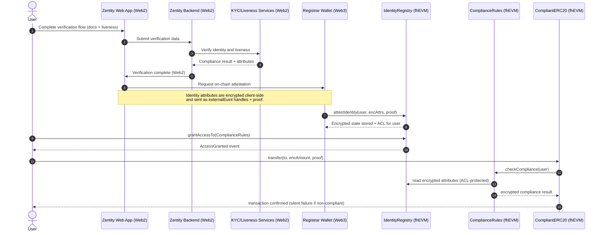

# Zentity Architecture Explainer (Web2 -> Web3 Flow)

This document explains the end-to-end flow from Web2 verification to Web3
attestation and encrypted compliance checks.

## Web2 -> Web3 Data Flow

## What stays in Web2 vs Web3

### Web2 (Zentity Backend)
- **Collects and verifies identity data** (documents, liveness, etc.).
- **Produces the final compliance result** and attribute set.
- **Never stores plaintext on-chain**. Only encrypted attributes are sent to
  Web3 via the registrar flow.

### Web3 (fhEVM + Zama)
- **Stores encrypted identity attributes** in `IdentityRegistry` as ciphertext
  handles.
- **Enforces access via ACL**. Only explicitly granted contracts/users can use
  a given handle.
- **Computes compliance under encryption** in `ComplianceRules`.
- **Transfers are guarded** by encrypted compliance checks in `CompliantERC20`.

## Why the flow is secure (and complex)
- **Confidentiality** is preserved because the EVM never sees plaintext values.
- **Integrity** is enforced through ACL permissions and explicit caller checks.
- **Non-reverting patterns** (silent failure) prevent information leakage.

## Operational responsibilities
- **Users** must grant access to `ComplianceRules` once per network.
- **Deployments** must authorize `CompliantERC20` as an allowed caller in
  `ComplianceRules`.
- **UI** should surface access requirements and avoid caching access state
  locally (rely on on-chain events).
 - **Owners** should transfer ownership to a multisig using the two-step flow
   (`transferOwnership` → `acceptOwnership`) after deployments are verified.

## Practical checklist for integrators
- Ensure `grantAccessTo(ComplianceRules)` is called before any transfer attempts.
- Ensure `ComplianceRules.setAuthorizedCaller(tokenAddress, true)` is done at deploy.
- Handle silent failures in the UI (show effective transfer or warning).
- Avoid exposing arbitrary external calls from privileged contracts.
