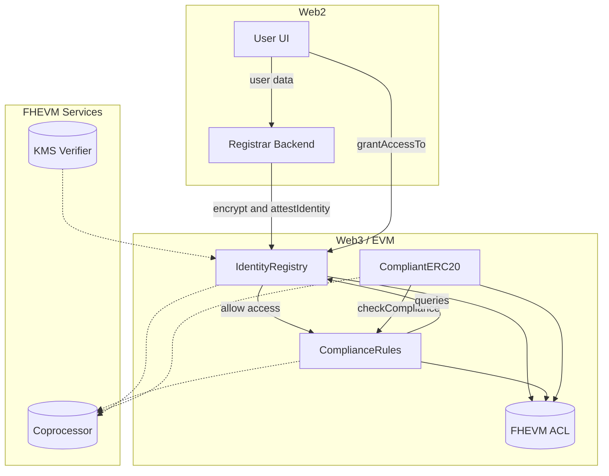
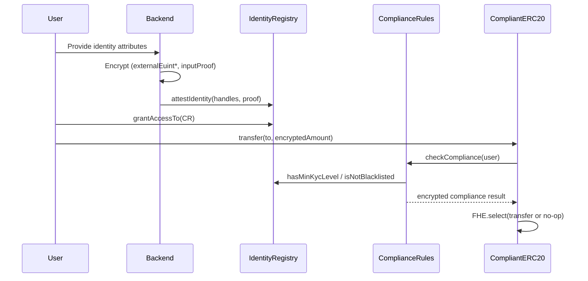

# Architecture

## Components

- **IdentityRegistry**
  - Stores encrypted user attributes (birth year offset, country code, KYC level, blacklist status).
  - Controlled by registrars (typically the backend).

- **ComplianceRules**
  - Runs encrypted checks against the registry and caches encrypted results.
  - Authorizes callers (e.g., the token) that can request compliance checks.

- **CompliantERC20**
  - Demo token that enforces compliance on transfers using encrypted checks.
  - Uses branch-free logic to avoid leaking sensitive conditions.

## High-level flow

1) Registrar attests user data into `IdentityRegistry` (encrypted inputs).
2) User grants access to `ComplianceRules`.
3) `ComplianceRules` computes encrypted compliance results.
4) `CompliantERC20` calls `ComplianceRules` to decide transfer eligibility.

## Architecture diagram (overview)

## Data flow diagram (attestation + compliant transfer)

## Notes

- Encrypted arithmetic is unchecked (wraps), so guard patterns may be required.
- Authorization checks must be enforced at the point of use.
- Async decrypt flows must be one-time use to avoid replay.
