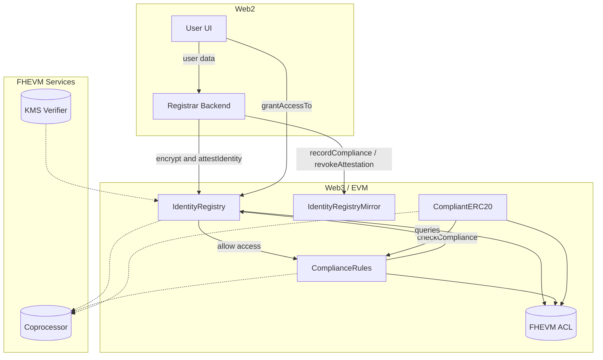
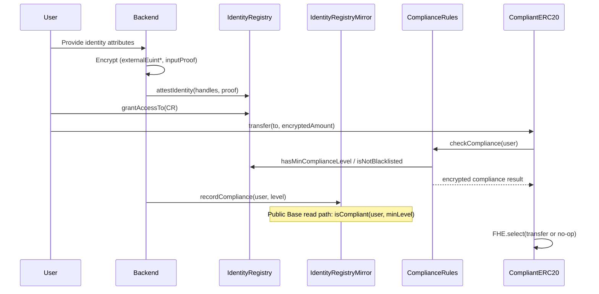

# Architecture

This document describes the current repository architecture and demo-oriented
flow. For the recommended long-term product direction, see
[Production Attestation Architecture](production-attestation-architecture.md).
That document is the canonical rationale for the public Base mirror boundary;
this page focuses on the contracts in this package.

## Components

- **IdentityRegistry**
  - Stores encrypted user attributes (birth year offset, country code, compliance (KYC) level, blacklist status).
  - Controlled by registrars (typically the backend).

- **ComplianceRules**
  - Runs encrypted checks against the registry and caches encrypted results.
  - Authorizes callers (e.g., the token) that can request compliance checks.

- **CompliantERC20**
  - Demo token that enforces compliance on transfers using encrypted checks.
  - Uses branch-free logic to avoid leaking sensitive conditions.

- **IdentityRegistryMirror**
  - Plaintext Base Sepolia mirror for public, level-aware compliance reads.
  - Stores only attested/unattested state and the current compliance level.
  - Exposes `isCompliant(address user, uint8 minLevel)` for x402 resource
    servers and settlement contracts.

## High-level flow

1) Registrar attests user data into `IdentityRegistry` on Ethereum Sepolia
   (encrypted inputs).
2) User grants access to `ComplianceRules`.
3) `ComplianceRules` computes encrypted compliance results.
4) `CompliantERC20` calls `ComplianceRules` to decide transfer eligibility.
5) After a Sepolia attestation is confirmed, Zentity can mirror the current
   public compliance level to `IdentityRegistryMirror` on Base Sepolia.

## Architecture diagram (overview)

```mermaid
flowchart TB
  subgraph Web2[Web2]
    UI[User UI]
    Backend[Registrar Backend]
  end

  subgraph Web3[Web3 / EVM]
    direction TB
    IR[IdentityRegistry]
    Mirror[IdentityRegistryMirror]
    Token[CompliantERC20]
    CR[ComplianceRules]
    ACL[(FHEVM ACL)]
  end

  subgraph FHEVM[FHEVM Services]
    Coprocessor[(Coprocessor)]
    KMS[(KMS Verifier)]
  end

  UI -->|user data| Backend
  Backend -->|encrypt and attestIdentity| IR
  Backend -->|recordCompliance / revokeAttestation| Mirror
  UI -->|grantAccessTo| IR
  IR -->|allow access| CR

  Token -->|checkCompliance| CR
  CR -->|queries| IR

  IR --> ACL
  CR --> ACL
  Token --> ACL

  IR -.-> Coprocessor
  CR -.-> Coprocessor
  Token -.-> Coprocessor
  KMS -.-> IR
```

## Data flow diagram (attestation + compliant transfer)

```mermaid
sequenceDiagram
  participant User
  participant Backend
  participant IR as IdentityRegistry
  participant Mirror as IdentityRegistryMirror
  participant CR as ComplianceRules
  participant Token as CompliantERC20

  User->>Backend: Provide identity attributes
  Backend->>Backend: Encrypt (externalEuint*, inputProof)
  Backend->>IR: attestIdentity(handles, proof)

  User->>IR: grantAccessTo(CR)

  User->>Token: transfer(to, encryptedAmount)
  Token->>CR: checkCompliance(user)
  CR->>IR: hasMinComplianceLevel / isNotBlacklisted
  CR-->>Token: encrypted compliance result

  Backend->>Mirror: recordCompliance(user, level)
  Note over Mirror: Public Base read path: isCompliant(user, minLevel)
  Token->>Token: FHE.select(transfer or no-op)
```

## Notes

- Encrypted arithmetic is unchecked (wraps), so guard patterns may be required.
- Authorization checks must be enforced at the point of use.
- Async decrypt flows must be one-time use to avoid replay.
- The Base mirror is not an identity database. Any new public predicate beyond
  `isCompliant` needs an explicit privacy review before it is added.
- Integrators should use the exported ABI, deployment manifest, and viem helpers
  from `@zentity/contracts` instead of copying addresses or ABI JSON by hand.
